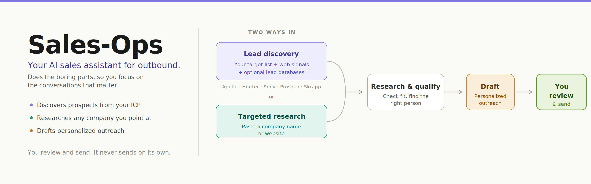

# Sales-Ops



**Your AI sales assistant that does the boring parts of outbound, so you can focus on actual conversations.**

Two ways to use it:

- **You need leads?** Tell it your ICP (who you sell to) and run a scan — it discovers new prospects from your named target list, WebSearch signals (funding news, role postings, trigger events), and optional lead databases (Apollo, Hunter, Snov, Prospeo, Skrapp).
- **You already have a target?** Paste the company name or website — Sales-Ops researches them, figures out if they're a good fit, finds the right person to contact, and drafts personalized outreach.

Either way, it drafts the outreach. You review and send. It never sends anything on its own.

---

## What it actually does

Think of it as an SDR (Sales Development Rep) that sits next to you:

1. **Finds prospects** — scans public signals (companies matching your ICP, recent funding, compliance triggers, relevant news) and builds a list of companies worth reaching out to.
2. **Qualifies each one** — writes a one-page report: are they a real fit? who's the decision-maker? what's the hook? any red flags?
3. **Drafts outreach** — 3 email variants, a LinkedIn DM, a call opener, a voicemail script. All personalized. All in your voice.
4. **Tracks follow-ups** — reminds you who's overdue, drafts the next touch with a fresh angle, and writes the breakup message if they go cold.
5. **Learns what works** — after a few weeks, tells you which industries / titles / channels actually convert, so you double down on what's working.

### What it does NOT do

- Does **not** send emails or messages for you. You review and send.
- Does **not** do mass blasts. Quality over volume is the whole point.
- Does **not** fake case studies, name-drop strangers, or manufacture urgency.

---

## Who this is for

- Founders doing their own outbound
- SDRs / AEs who want better prep in less time
- Sales ops folks standardizing how their team qualifies accounts
- Anyone tired of writing the same "Hi {firstName}" email 40 times a week

You don't need to be technical to *use* it day to day — once it's set up, you talk to it in plain English ("qualify stripe.com", "draft outreach for the Acme lead", "who's overdue this week?").

You **do** need someone technical for the **one-time setup** (installing Node.js, running a few commands). That takes about 15 minutes. See [USAGE.md](USAGE.md).

---

## A day in the life

```
You:       scan
Sales-Ops: Found 12 new companies matching your ICP. 4 look like strong
           fits based on recent funding and role patterns. Want me to
           qualify them?

You:       yes, top 4
Sales-Ops: [writes 4 reports, adds to tracker]
           Ramp scored 4.2/5 — strongest fit. Want outreach drafts?

You:       qualify ramp.com         # or paste any company you already know
Sales-Ops: [same flow — report + decision-maker + angle]

You:       draft outreach
Sales-Ops: 3 email variants, LinkedIn DM, call opener — all personalized.

You:       [edit, send from your inbox]

You:       who's overdue?
Sales-Ops: 4 prospects haven't heard from you in 5+ days. Want drafts?
```

---

## Quick start

**See [USAGE.md](USAGE.md) for the full step-by-step guide** (setup, commands, what each one produces, free-tier reality check, troubleshooting).

Fast path (assumes Node.js 18+ and [Claude Code](https://claude.com/claude-code) installed):

```bash
git clone https://github.com/mukul-07/opensource-sales-ops.git
cd opensource-sales-ops
npm install
npx playwright install chromium
node doctor.mjs            # shows what's missing

# Set up the 4 user-layer files (details in USAGE.md):
cp config/profile.example.yml config/profile.yml
cp templates/portals.example.yml portals.yml
cp modes/_profile.template.md modes/_profile.md
# Create pitch.md and case-studies.md from scratch

# (Optional) Lead-enrichment API keys — see docs/LEAD_ENRICHMENT.md
cp .env.local.example .env.local

# Run Claude Code:
claude

# In the session:
/sales-ops                    # discovery menu
/sales-ops {company-url}      # auto-pipeline: qualify + report + tracker
/sales-ops scan               # discover new prospects via manual + Apollo + WebSearch
/sales-ops pipeline           # qualify the URLs in data/pipeline.md
```

---

## Status

**v0.1.0 — early public release.** Core flow works, but expect rough edges:

- Upstream update pull is intentionally disabled. Re-enable in [update-system.mjs](update-system.mjs) by repointing URLs to your own fork.
- Some `.mjs` scripts still use inherited field names (archetype, remote policy, etc.). They run correctly but the field semantics are being repurposed gradually.
- No CRM integration yet. Tracker is markdown-only (`data/prospects.md`).
- English only in v0. Add localization per-market if needed.

## Stack

- Node.js (mjs modules), Playwright (scraping + verification)
- YAML config, Markdown data
- [Claude Code](https://claude.com/claude-code) (primary) + [OpenCode](https://opencode.ai) (secondary) as the agent runtimes

## Ethical notes

Outbound done badly wastes everyone's time. A few rules built into the system:

- Don't fake case studies, don't manufacture urgency, don't namedrop people you don't know.
- Don't run mass sends. The point of this is better-targeted, not more-frequent.
- Respect prospect attention. Every cold touch costs someone 30 seconds; make it worth reading.

## Contributing

See [CONTRIBUTING.md](CONTRIBUTING.md) and [CODE_OF_CONDUCT.md](CODE_OF_CONDUCT.md). Issues and discussions welcome.

## License

MIT — see [LICENSE](LICENSE). Originally forked from [santifer/career-ops](https://github.com/santifer/career-ops) (also MIT), then repurposed from job-search automation into outbound sales.
